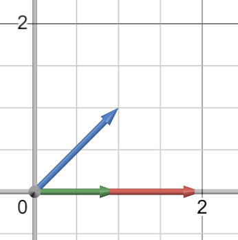

# Linear Regression App

## Description
The Linear Regression App allows you to input your data points and make predictions based on linear regression. The app utilizes advanced mathematical computations derived from linear algebra to provide accurate and reliable predictions.

## Features
1. **Input Data Points**: Users can input their own data points directly into the app.
2. **Graphing Interface**: Visualize your data points and the resulting regression line.
3. **Background Customization**: Customize the background of your graph with either a color or an image.
4. **AI Model Creation**: Create and save your AI models for future predictions.


## Summary
- **Construct Matrix $`A`$ and Vector $`b`$:** These represent the system of equations for the points.
- **Projection and Gram-Schmidt:** The projection function helps in computing orthogonal vectors. The Gram-Schmidt process orthogonalizes these vectors to form the matrix $`Q`$.
- **Compute $`R`$:** By multiplying $`Q^T`$ and $`A`$, we get $`R`$.
- **Solve for Slope and Intercept:** Finally, by solving the system $`R x = Q^T b`$, we find the slope and intercept of the best fit line.


## Math Behind How to Find the Line of Best Fit using QR Factorization

### 1. Gather the Points
Start with the points you want to find the line of best fit for. Example points: $`(0,0)`$, $`(1,0)`$, $`(1,2)`$. These are the points I will use while explaining.

---

### 2. Convert the Slope-Intercept Equation to a System of Linear Equations
Create matrix $`A`$ and vector $`\vec{b}`$ from the points with this equation: where $`m`$ is the slope and $`b`$ is the y-intercept. Don't confuse variable $`b`$ with vector $`\vec{b}`$
```math
y = mx + b
```
#### Plug in the x and y values from the points into each equation. 

Note: written next to b in the slope-intercept equation is (1) just to show a coefficient of 1, as b(1) just equals b, but it helps with visualizing where A comes from.

**For the point $`(0,0)`$:**
- Equation: $`(0) = m(0) + b(1)`$

**For the point $`(1,0)`$:**
- Equation: $`(0) = m(1) + b(1)`$

**For the point $`(1,2)`$:**
- Equation: $`(2) = m(1) + b(1)`$

Matrix $`A`$ is made from the coefficients next to $`m`$ and $`b`$:
```math
A = \begin{bmatrix} 0 & 1 \\ 1 & 1 \\ 1 & 1 \end{bmatrix}
```

Vector $`\vec{b}`$ is made from the y-values:
```math
\vec{b} = \begin{bmatrix} 0 \\ 0 \\ 2 \end{bmatrix}
```

We represent $`\begin{bmatrix} m \\ b \end{bmatrix}`$ as vector $`\vec{x}`$. Thus, the matrix equation is:
```math
A\vec{x} = \vec{b} \quad \text{or} \quad \begin{bmatrix} 0 & 1 \\ 1 & 1 \\ 1 & 1 \end{bmatrix} \begin{bmatrix} m \\ b \end{bmatrix} = \begin{bmatrix} 0 \\ 0 \\ 2 \end{bmatrix}
```

---

### 3. Objective: Find the Line of Best Fit
To find the line of best fit, we need to determine the values of vector $`\vec{x}`$ that makes matrix $`A`$ most closely approximate to vector $`\vec{b}`$. To do this we first need to use QR factorization.

---

### 4. QR Factorization
We use QR factorization to convert matrix $`A`$ into two factors, $`Q`$ and $`R`$:
```math
A = QR
```

Understand that you can look at the set of columns of the matrix as a set of vectors, as a vector is really just a single column matrix
- #### $`Q`$ is an orthonormal matrix:
  - What makes an orthonormal matrix?
    1. The set of columns (vectors) are orthogonal (point in directions perpendicular to each other). Look up pictures of orthogonal vectors if confused.
    2. The set of columns (vectors) are normalized (unit length or length of 1).
      - For example, if $`\mathbf{v} = \begin{bmatrix} a \\ b \end{bmatrix}`$, then the length would be equal to $`\sqrt{a^2 + b^2}`$, which must be equal to 1 to be considered normalized. **So to normalize any vector just divide its values by its length.**

  - Example of an orthonormal matrix: This is the identity matrix and is made up of ones on the diagonal. It is also orthonormal. In other words, the columns are both unit vectors and perpendicular to each other.
```math
\begin{bmatrix} 1 & 0 \\ 0 & 1 \end{bmatrix}
```
  - Property of an orthonormal matrix: $`Q^T = Q^{-1}`$.
    - Q Transpose = Q Inverse
    - Don't forget the property of orthonormal matrices, we will use it later.
    -  More info:
        - A transpose of a matrix is basically just flipping it in a certain way that makes it so all the columns become the rows and the rows become the columns.
        - Here is an example:
```math
\mathbf{A} = \begin{pmatrix}
1 & 2 \\
3 & 4
\end{pmatrix}
\qquad
\mathbf{A}^T = \begin{pmatrix}
1 & 3 \\
2 & 4
\end{pmatrix}
```


- **R** is an upper triangular matrix:
  - What is an upper triangular matrix
    - Non-zero entries are above or on the main diagonal.
  - Example of an upper triangular matrix:
```math
\begin{bmatrix} 1 & 2 \\ 0 & 3 \end{bmatrix}
```

---

### 5. Understanding projection of vectors

We will need to understand how vector projection works in order to continue, so let's project vector $` \mathbf{a} = [1,1] `$ onto vector $` \mathbf{b} = [2,0] `$.

To find the projection, you can visualize it or use the projection equation:
```math
\text{proj}_{\mathbf{b}} \mathbf{a} = \frac{\mathbf{a} \cdot \mathbf{b}}{\mathbf{b} \cdot \mathbf{b}} \mathbf{b}
```

- **Dot Product Calculation**:
```math
\mathbf{a} \cdot \mathbf{b} = 1 \cdot 2 + 1 \cdot 0 = 2
```
```math
\mathbf{b} \cdot \mathbf{b} = 2 \cdot 2 + 0 \cdot 0 = 4
```

- **Projection Calculation**:
```math
\text{proj}_{\mathbf{b}} \mathbf{a} = \frac{2}{4} \mathbf{b} = \frac{1}{2} [2,0] = [1,0]
```

To understand this visually, imagine the two vectors were real rods, and you shined a light directly above them. The shadow of the $`[1,1]`$ blue rod (vector $`\mathbf{a}`$) on the $`[2,0]`$ red rod (vector $`\mathbf{b}`$) would be like $`[1,0]`$ green vector.




Now, the reason we use projection to get orthogonal vectors is because if you take a vector and subtract its projection onto another vector, you are left with the perpendicular part of the vector. 

For example, with the vectors $`[1,1]`$ and $`[2,0]`$:
- Subtracting $`[1,1]`$ by its projection $`[1,0]`$ leaves you with $`[0,1]`$.
- The vectors $`[0,1]`$ and $`[2,0]`$ are perpendicular.

---

### 6. Finding Matrix $`Q`$ using Gram-Schmidt Process
The Gram-Schmidt process converts the columns of $`A`$ into an orthogonal set of vectors $`[u_1, u_2]`$. Look up the Gram-Schmidt process for more info.

- Start with matrix $`A`$:
```math
A = \begin{bmatrix} 0 & 1 \\ 1 & 1 \\ 1 & 1 \end{bmatrix}
```
  Original vectors from A's columns: $`\mathbf{v}_1 = \begin{bmatrix} 0 \\ 1 \\ 1 \end{bmatrix}`$ and $`\mathbf{v}_2 = \begin{bmatrix} 1 \\ 1 \\ 1 \end{bmatrix}`$.

- **Finding $`\mathbf{u}_1`$**: The first vector just equals the first original vector
```math
\mathbf{u}_1 = \mathbf{v}_1 = \begin{bmatrix} 0 \\ 1 \\ 1 \end{bmatrix}
```

- **Finding $`\mathbf{u}_2`$**: Now we subtract the projection of $`v_2`$, so we are just left with the perpendicular part.
```math
\mathbf{u}_2 = \mathbf{v}_2 - \text{proj}_{\mathbf{u}_1} \mathbf{v}_2 = \begin{bmatrix} 1 \\ 1 \\ 1 \end{bmatrix} - \begin{bmatrix} 0 \\ 1 \\ 1 \end{bmatrix} = \begin{bmatrix} 1 \\ 0 \\ 0 \end{bmatrix}
```

Now that we have an orthogonal (perpendicular) set of vectors, we need to normalize them to make their length equal to 1. This will make the vectors both orthogonal and normalized, or orthonormal. Fortunately, $`u_2`$ is already a length of 1, so we just need to normalize $`u_1`$

- **Normalize** $`\mathbf{u}_1`$:
```math
\mathbf{u}_1 = \begin{bmatrix} 0 \\ \frac{1}{\sqrt{2}} \\ \frac{1}{\sqrt{2}} \end{bmatrix}
```

Put $`u_1`$ and $`u_2`$ together to make the orthonormal matrix $`Q`$
- **Matrix $`Q`$**:
```math
Q = \begin{bmatrix} 0 & 1 \\ \frac{1}{\sqrt{2}} & 0 \\ \frac{1}{\sqrt{2}} & 0 \end{bmatrix}
```

---

### 7. Finding the Upper Triangular Matrix $`R`$
This part is much easier once you know Q. Since you know 
```math
A = QR
```
1. Multiply both sides by $`Q^{-1}`$:
  - $`Q^{-1}Q`$ basically cancels itself out, so it just equals $`R`$
```math
Q^{-1} A = R
```
2. Use the property of orthonormal matrices ($`Q^T = Q^{-1}`$):
```math
Q^T A = R
\qquad
or
\qquad
R = Q^T A
```

Knowing:
```math
Q = \begin{bmatrix} 0 & 1 \\ \frac{1}{\sqrt{2}} & 0 \\ \frac{1}{\sqrt{2}} & 0 \end{bmatrix}
\qquad
\qquad
and
\qquad
\qquad
A = \begin{bmatrix} 0 & 1 \\ 1 & 1 \\ 1 & 1 \end{bmatrix}
```

Compute $`R`$:
```math
R = \begin{bmatrix} 0 & \frac{1}{\sqrt{2}} & \frac{1}{\sqrt{2}} \\ 1 & 0 & 0 \end{bmatrix} \begin{bmatrix} 0 & 1 \\ 1 & 1 \\ 1 & 1 \end{bmatrix} = \begin{bmatrix} \sqrt{2} & \sqrt{2} \\ 0 & 1 \end{bmatrix}
```

---

### 8. Solving for $`\vec{x} = [m, b]`$
So go back to the equation from the beginning $`A\vec{x} = \vec{b}`$. Lets now finally plugin the QR factorization for $`A`$ where $`A = QR`$, which gives us a new equation
```math
A\vec{x} = \vec{b} \implies QR\vec{x} = \vec{b}
```
#### Simplify this equation:
1. Multiply both sides by $`Q^T`$:
```math
Q^T QR\vec{x} = Q^T \vec{b} \implies R\vec{x} = Q^T \vec{b}
```
2. Multiply by $`R^{-1}`$:
```math
\vec{x} = R^{-1} Q^T \vec{b}
```

Given:
```math
Q^T \vec{b} = \begin{bmatrix} 0 & \frac{1}{\sqrt{2}} & \frac{1}{\sqrt{2}} \\ 1 & 0 & 0 \end{bmatrix} \begin{bmatrix} 0 \\ 0 \\ 2 \end{bmatrix} = \begin{bmatrix} \sqrt{2} \\ 0 \end{bmatrix}
```

Get $`R^{-1}`$: For more info on how to calculate the inverse of a matrix, look up `Finding inverse of a matrix with RREF` (Row Reduced Echelon Form)
```math
R^{-1} = \begin{bmatrix} \frac{1}{\sqrt{2}} & 0 \\ -1 & 1 \end{bmatrix}
```

Compute $`\vec{x}`$: With equation \vec{x} = R^{-1} Q^T \vec{b}
```math
\vec{x} = \begin{bmatrix} \frac{1}{\sqrt{2}} & 0 \\ -1 & 1 \end{bmatrix} \begin{bmatrix} \sqrt{2} \\ 0 \end{bmatrix} = \begin{bmatrix} 1 \\ 0 \end{bmatrix}
```

---

### 9. Assign the Values of $`x`$ to Slope (m) and Intercept (b)
```math
x = [m, b] = [1, 0]
```

The line of best fit is:
```math
y = mx + b \implies y = 1x + 0 \implies y = x
```

The final answer is $`y = x`$. This is how you use QR factorization to find the line of best fit.
```
